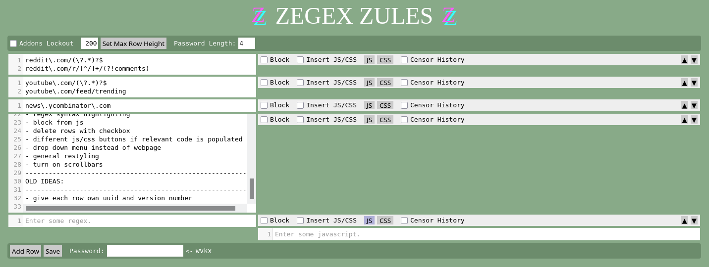

# ZEGEX_ZULES
A Firefox addons that allows the user to apply certain settings to webpages selected via RegEx.

Features currently include:

- Blocking webpages
- Applying custom JS
- Applying custom CSS
- Removing from history
- Randomly generating a password to the settings page to slow down access to it for the undisciplined

Possible Ideas for the future are:

- Blocking/Restricting Cookies
- Assigning to Firefox container tabs

